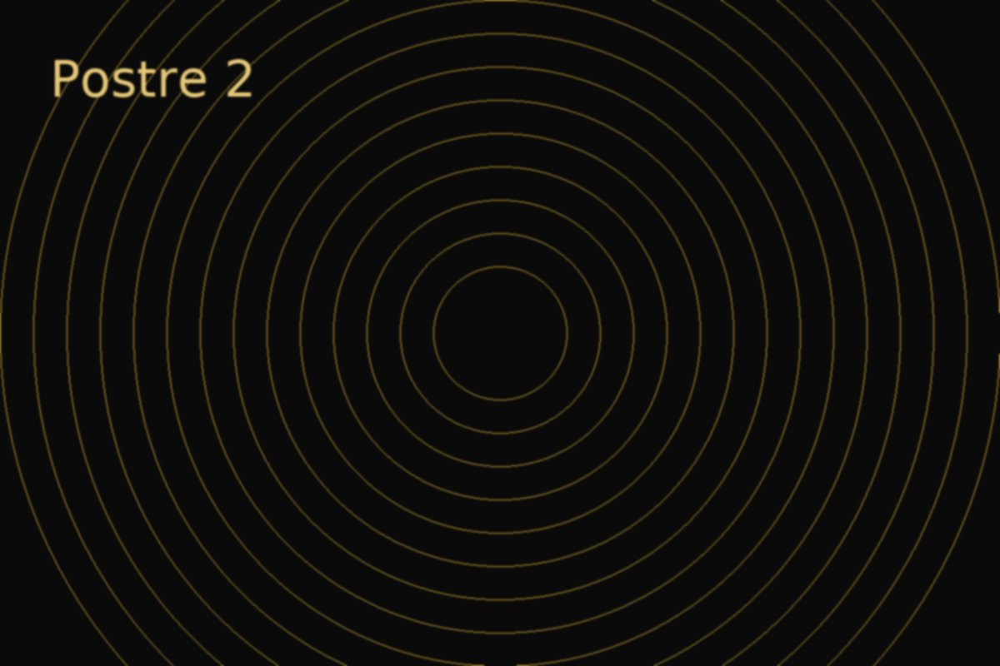

# Squazita Dulces 🍰✨

Sitio web estático de la marca **Squazita Dulces**  
Paleta: negro + dorado · Diseño elegante y responsivo · Animaciones sutiles

## 🚀 Demo local
```bash
# clonar repo o descargar ZIP
cd squazita_site
# abrir localmente
python -m http.server
# en el navegador abrir: http://localhost:8000
```

## 🖼️ Capturas (ejemplo)



## ✨ Características
- Diseño responsive (desktop/móvil)
- Tipografías de Google Fonts: *Playfair Display* + *Raleway*
- Fondo animado con estrellas
- Secciones: Inicio, Carta, Nosotros, Catering, Contacto
- Formulario de contacto con integración **Formspree**
- Fácil despliegue en **GitHub Pages** o **Netlify**

## 📩 Formulario de contacto
En `index.html`, el formulario apunta a Formspree:
```html
<form action="https://formspree.io/f/yourFormID" method="POST">
```
1. Crea una cuenta en [Formspree](https://formspree.io/)  
2. Reemplaza `yourFormID` con el ID de tu proyecto

## 📦 Deploy en GitHub Pages
1. Subir este repo a tu cuenta de GitHub
2. En Settings → Pages → Source: seleccionar branch `main` y carpeta `/root`
3. Guardar y abrir tu dominio: `https://tuusuario.github.io/squazita_site`

## 👨‍💻 Créditos
- Diseño adaptado por [Tu Nombre]  
- Logo: proporcionado por el cliente  
- Imágenes de ejemplo: placeholders generados automáticamente  

---
© Squazita Dulces
